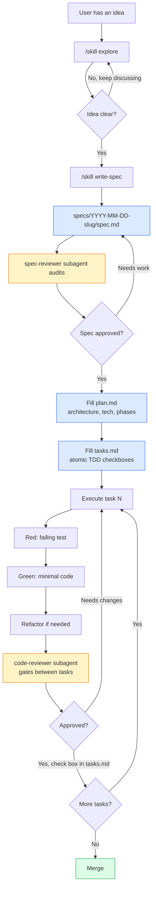

# claude-spec-driven-template

**A practical template repository for structuring AI-enabled projects**
**with shared instructions, Claude-specific configuration, subagents, skills, hooks, and spec-driven development.**


---

## Overview

`claude-spec-driven-template` is a stack-agnostic template for structuring repositories around AI coding agents. It shows where each AI instruction file belongs, how the layers interact, and how to combine them with spec-driven development.

This is not just a folder tree. It is a working reference whose own AI setup is part of the lesson.

It combines:

- shared agent instructions in [`AGENTS.md`](./AGENTS.md)
- Claude-specific guidance in [`CLAUDE.md`](./CLAUDE.md)
- Copilot-specific guidance in [`.github/copilot-instructions.md`](./.github/copilot-instructions.md)
- shared schemas and contracts in [`ECOSYSTEM.md`](./ECOSYSTEM.md)
- contributor workflow in [`CONTRIBUTING.md`](./CONTRIBUTING.md)
- change history in [`CHANGELOG.md`](./CHANGELOG.md)
- internal Claude config in [`.claude/`](./.claude)
- human-facing project docs in [`docs/`](./docs)
- spec-driven features in [`specs/`](./specs)
- nested CLAUDE.md examples in [`src/`](./src)
- a guided course in [`LEARN.md`](./LEARN.md)
- setup walkthrough in [`docs/guides/initial-setup.md`](./docs/guides/initial-setup.md)

---

## Quick navigation

- [Who this is for](#who-this-is-for)
- [Learn this repo](#learn-this-repo)
- [Why this repo exists](#why-this-repo-exists)
- [How to read this repo](#how-to-read-this-repo)
- [How the AI layers connect](#how-the-ai-layers-connect)
- [Project structure](#project-structure)
- [Shared root layer](#shared-root-layer)
- [Internal Claude layer](#internal-claude-layer)
- [Spec-driven layer](#spec-driven-layer)
- [Nested instructions in src](#nested-instructions-in-src)
- [Preparing for brownfield](#preparing-for-brownfield)
- [Recommended ecosystem](#recommended-ecosystem)
- [Decision table: where does this instruction go?](#decision-table-where-does-this-instruction-go)
- [What hooks are doing here](#what-hooks-are-doing-here)
- [What this repo is demonstrating](#what-this-repo-is-demonstrating)
- [Using this template](#using-this-template)
- [Attributions](#attributions)

---

## Who this is for

- Developers building an AI-enabled repo from scratch
- Teams that want a cleaner Claude Code setup
- People learning what each AI-related file is for
- Maintainers who want internal AI helpers for review, structure, and documentation
- Anyone who wants a repo that is both a template and a teaching example

---

## Learn this repo

Want the guided version instead of just the structure?

Read [`LEARN.md`](./LEARN.md) for a short course that explains:

- what each AI layer is for
- a decision table for choosing where instructions go
- how the files relate to each other
- best practices for writing them
- templates you can copy
- the spec-driven workflow with Superpowers

---

## Why this repo exists

This repository answers questions like:

- What is `AGENTS.md` for? What about `CLAUDE.md`?
- What is the difference between rules, skills, agents, and hooks?
- Where do I put knowledge about external libs?
- How do I keep CLAUDE.md from becoming a 2000-line wiki?
- How do specs, plans, and code stay in sync?
- How do I build a repo that an AI agent can actually navigate?

This repo has three jobs at once:

- **template** to copy
- **reference implementation** to study
- **learning repo** to read

---

## How to read this repo

A simple reading order:

1. [`README.md`](./README.md) (this file)
2. [`LEARN.md`](./LEARN.md)
3. [`AGENTS.md`](./AGENTS.md)
4. [`CLAUDE.md`](./CLAUDE.md)
5. [`CONTRIBUTING.md`](./CONTRIBUTING.md)
6. [`.claude/`](./.claude/)
7. [`specs/`](./specs/)
8. [`src/example-module/CLAUDE.md`](./src/example-module/CLAUDE.md)

---

## How the AI layers connect

- `README.md` introduces the repo and points to the right places
- `LEARN.md` is the guided course
- `AGENTS.md` is the **shared source of truth** for any coding agent (Codex, Cursor, Gemini CLI, Claude Code, GitHub Copilot) - stack, commands, structure, conventions, workflow
- `CLAUDE.md` is a **stub** pointing to AGENTS.md, with Claude Code-specific additions on top (skills, agents, hooks references)
- `.github/copilot-instructions.md` is another **stub** for GitHub Copilot, same pattern (points to AGENTS.md, adds Copilot-specific extras)
- `ECOSYSTEM.md` defines shared schemas across surfaces
- `CONTRIBUTING.md` explains how to change things without breaking the teaching value
- `.claude/` contains Claude-specific configuration: skills, agents, rules, docs, hooks
- `specs/` contains the spec-driven artifacts: one folder per feature with spec + plan
- `src/<module>/CLAUDE.md` adds nested instructions scoped to a single folder (still full content, not stub)

```
┌──────────────────────────────────────────────────────────────┐
│ Cross-tool source of truth (always loaded by all agents)     │
│   AGENTS.md  ECOSYSTEM.md                                    │
└────────────────────────┬─────────────────────────────────────┘
                         │
                         ↓
                    CLAUDE.md (stub → AGENTS.md + Claude extras)
                         │
        ┌────────────────┼────────────────┐
        ↓                ↓                ↓
   .claude/         specs/             src/<module>/
   ├─ skills/     YYYY-MM-DD-slug/    └─ CLAUDE.md
   ├─ agents/     ├─ spec.md             (nested, full content)
   ├─ rules/      └─ plan.md
   ├─ docs/
   └─ hooks/
   (loaded on demand or by trigger)
```

---

## Project structure

```
claude-spec-driven-template/
├─ .claude/                                # Internal Claude config
│  ├─ agents/                              # Subagents: isolated specialists
│  │  ├─ spec-reviewer.md                  # Audits spec.md before it becomes plan.md
│  │  ├─ code-reviewer.md                  # Reviews code against plan and conventions
│  │  ├─ researcher.md                     # Deep-dives on libs, accumulates MEMORY.md
│  │  ├─ codebase-explorer.md              # Read-only archaeology, uses Repomix snapshot
│  │  └─ security-auditor.md               # Audits auth, secrets, validation
│  │
│  ├─ skills/                              # Reusable workflows loaded on demand
│  │  ├─ example-skill/SKILL.md            # Anatomy of a skill (rename and adapt)
│  │  ├─ analyze-codebase/SKILL.md         # First-time setup on existing projects
│  │  ├─ refresh-snapshot/SKILL.md         # Manually regenerate Repomix snapshot
│  │  ├─ explore/SKILL.md                  # Investigate before writing a spec
│  │  ├─ find-existing-first/SKILL.md      # Reuse before create
│  │  ├─ write-spec/SKILL.md               # Persist a shaped idea as spec.md
│  │  └─ documenting-domains/              # Durable domain docs (attribution: douglasgomes98)
│  │     ├─ SKILL.md
│  │     └─ references/                    # Templates and checklists
│  │
│  ├─ rules/                               # Path-scoped conventions (auto-load by glob)
│  │  ├─ git-workflow.md                   # Branch naming, Conventional Commits, PRs
│  │  └─ example-rule.md                   # Rule template with paths: frontmatter
│  │
│  ├─ docs/                                # AI-only knowledge (loaded only when referenced)
│  │  ├─ superpowers.md                    # How spec-driven flow works here
│  │  └─ libs/                             # One doc per external lib (as agents use them)
│  │     └─ example-lib.md
│  │
│  ├─ hooks/                               # Scripts triggered on tool lifecycle events
│  │  ├─ block-secrets.sh                  # Blocks reading .env via Bash
│  │  ├─ protect-main.sh                   # Blocks commits/push on main/master
│  │  ├─ protect-critical.sh               # Blocks edits to lockfiles, migrations, generated code
│  │  └─ check-snapshot-on-session.sh      # SessionStart hook, warns on stale snapshot
│  │
│  ├─ scripts/                             # Utility scripts used by hooks and agents
│  │  └─ check-snapshot.sh                 # Classifies Repomix snapshot staleness
│  │
│  ├─ context/                             # Generated context (gitignored)
│  │  └─ repomix-snapshot.md               # Codebase pack (auto-refreshed when stale)
│  │
│  └─ settings.json                        # Permissions, hooks registration, model
│
├─ docs/                                   # Human-facing project docs
│  ├─ README.md                            # Layout guide for docs/
│  ├─ CONSTITUTION.md.example              # Project DNA template (rename and fill)
│  ├─ architecture/overview.md             # System overview, trust model, data flows
│  ├─ decisions/                           # ADRs (immutable, numbered)
│  ├─ runbooks/                            # Operational procedures
│  ├─ guides/
│  │  ├─ README.md
│  │  └─ initial-setup.md                  # Walkthrough for adopting the template
│  └─ patterns/                            # "How we solved X" living examples
│
├─ specs/                                  # Spec-driven development
│  ├─ README.md                            # Explains the three-file pattern
│  └─ YYYY-MM-DD-<slug>/                   # One folder per feature (created by write-spec)
│     ├─ spec.md                           # WHAT + WHY (source of truth)
│     ├─ plan.md                           # HOW at high level (architecture, phases)
│     └─ tasks.md                          # HOW at execution level (atomic TDD checkboxes)
│
├─ src/                                    # Application code
│  └─ example-module/
│     └─ CLAUDE.md                         # Nested instructions for this folder
│
├─ .github/                                # GitHub-facing files
│  ├─ ISSUE_TEMPLATE/
│  │  ├─ bug_report.md
│  │  ├─ feature_request.md
│  │  └─ question.md
│  ├─ PULL_REQUEST_TEMPLATE.md
│  └─ copilot-instructions.md              # Stub pointing to AGENTS.md + Copilot-specific extras
│
├─ .claudeignore                           # Patterns excluded from auto context
├─ .gitignore                              # Standard + AI-specific entries
├─ AGENTS.md                               # Source of truth for all agents (Claude, Codex, Cursor, etc)
├─ CHANGELOG.md                            # Version history
├─ CLAUDE.md                               # Stub pointing to AGENTS.md + Claude-specific extras
├─ CLAUDE.local.md.example                 # Personal overrides template (rename to use)
├─ CONTRIBUTING.md                         # How to contribute without breaking teaching value
├─ ECOSYSTEM.md                            # Shared schemas and contracts
├─ LEARN.md                                # Guided course
├─ LICENSE                                 # MIT
└─ README.md                               # This file
```

---

## Shared root layer

The highest-level explanation layer. These files are read by humans and agents alike.

### [`README.md`](./README.md)

The human entry point. Explains what the repo is, how layers fit together, and how to reuse the structure.

### [`AGENTS.md`](./AGENTS.md)

**Source of truth for all agents.** Cross-tool instructions read by Codex, Cursor, Gemini CLI, Claude Code, GitHub Copilot, and any other coding agent that supports the AGENTS.md convention. Contains the stack, commands, structure, conventions, workflow, and non-negotiables - everything an agent needs to be effective in this repo.

### [`CLAUDE.md`](./CLAUDE.md)

**Stub for Claude Code.** Points to AGENTS.md as the source of truth, then adds Claude-specific extras that don't apply to other agents: which skills, subagents, hooks, and rules ship in this project, plus the location of nested CLAUDE.md files. Loaded automatically at the start of every Claude Code session.

This avoids duplication: the stack lives in AGENTS.md alone. Update it there, all agents see the change. CLAUDE.md never goes out of sync because it doesn't own that content.

### [`.github/copilot-instructions.md`](./.github/copilot-instructions.md)

**Stub for GitHub Copilot.** Same pattern as CLAUDE.md but for the Copilot ecosystem (VS Code, JetBrains, Copilot Chat, Copilot Coding Agent, Copilot on GitHub.com). Points to AGENTS.md as source of truth, then adds Copilot-specific guidance. Loaded automatically when Copilot generates suggestions.

### [`ECOSYSTEM.md`](./ECOSYSTEM.md)

Shared schemas and contracts across surfaces of the system. Critical for multi-platform projects where multiple services must agree on field names, types, and enums.

### [`CONTRIBUTING.md`](./CONTRIBUTING.md)

How to make changes without breaking the repo's teaching value. Workflow rules, validation steps, conventions.

---

## Internal Claude layer

This is what makes Claude effective at this project specifically.

### [`.claude/skills/`](./.claude/skills/)

Reusable workflows. Each skill is a directory with a `SKILL.md`. The `description` in the frontmatter is the trigger: Claude reads it and auto-invokes the skill when it matches a task.

Use skills when you find yourself repeating the same multi-step process across sessions.

### [`.claude/agents/`](./.claude/agents/)

Subagents are specialists with isolated context windows. When invoked, they explore, read, and reason in their own session, then return a final summary. The main conversation stays clean.

Four templates included:

- **`spec-reviewer.md`** audits a spec before it becomes a plan
- **`code-reviewer.md`** reviews implementation against the plan
- **`researcher.md`** investigates libraries and accumulates a persistent `MEMORY.md`
- **`security-auditor.md`** audits auth, secrets, and input validation

The `description` field is the auto-delegation trigger. Convention: include "Use PROACTIVELY" or "Use when..." to push automatic delegation.

### [`.claude/rules/`](./.claude/rules/)

Path-scoped conventions. The `paths:` frontmatter glob determines when the rule auto-loads. Without `paths:`, the rule loads always (becoming a hidden CLAUDE.md).

### [`.claude/docs/`](./.claude/docs/)

Static knowledge that loads on demand only. Nothing here auto-loads. Skills and agents reference these docs explicitly when they need them.

Sub-folders:

- **`libs/`** one doc per external library or integration, focused on how this project uses it (not the official docs)
- **`decisions/`** architecture decision records, immutable once accepted

### [`.claude/hooks/`](./.claude/hooks/)

Scripts that run on Claude Code lifecycle events: `PreToolUse`, `PostToolUse`, `Stop`, `SessionStart`, `Notification`. Registered in `settings.json`.

The example `block-secrets.sh` is a `PreToolUse` hook that prevents the agent from reading `.env` files via Bash.

### [`.claude/settings.json`](./.claude/settings.json)

Permissions (`allow` and `deny`), hook registrations, and default model. Commit this. Personal overrides go in `.claude/settings.local.json` (gitignored).

---

## Spec-driven layer

### [`specs/`](./specs/)

The spec-driven development pattern, popularized by the Superpowers plugin. Each feature lives in its own folder:

```
specs/YYYY-MM-DD-feature-slug/
├─ spec.md       # WHAT to build, source of truth
└─ plan.md       # HOW to build, broken into 2-5min TDD tasks
```

The flow:



When code and spec diverge, the spec wins. Code gets fixed.

The `write-spec` skill ships the `spec.md` / `plan.md` / `tasks.md` templates in [`.claude/skills/write-spec/references/`](./.claude/skills/write-spec/references/) and copies them into `specs/YYYY-MM-DD-<slug>/` for you.

---

## Nested instructions in src

A `CLAUDE.md` placed inside a folder loads automatically when Claude navigates that folder. Use it for conventions that are specific to that layer of the code.

Example use cases:

- a server-side lib folder that should never import from the client
- a UI components folder with naming conventions
- an API folder with auth requirements

See [`src/example-module/CLAUDE.md`](./src/example-module/CLAUDE.md) for the pattern.

---

## Preparing for brownfield

Most projects are not built from scratch. If you're adopting this template on a codebase that already exists, the challenge is different: the agent needs to **understand what's already there** before it starts creating things. Left alone, agents treat every codebase as greenfield and confidently introduce parallel implementations of things that already exist.

This template ships six practices to counter that:

**1. `analyze-codebase` skill (one-time setup)**
Detects the tech stack, samples files to infer conventions, and generates `docs/CONSTITUTION.md`, `docs/architecture/overview.md`, `docs/CONVENTIONS.md`. For projects with 100+ files in `src/`, also generates a Repomix snapshot at `.claude/context/repomix-snapshot.md`.

**2. Repomix snapshot (panoramic context)**
[Repomix](https://github.com/yamadashy/repomix) packs the entire codebase into a single file that subagents read in isolated context. The `check-snapshot.sh` script classifies the snapshot as `fresh`, `stale-mild`, or `stale-major`. The `codebase-explorer` subagent refreshes automatically when stale-major. A `SessionStart` hook warns you when the snapshot is stale.

**3. `codebase-explorer` subagent (deep read)**
Read-only archaeology. Investigates the codebase, cross-references docs, returns findings without polluting the main context. Uses the snapshot when it's fresh; refreshes it when it's not.

**4. `find-existing-first` skill (reuse before create)**
Fires immediately before creating any new file. Searches synonyms, checks patterns, reports findings. Only proceeds to creation if nothing suitable exists.

**5. `explore` skill (think before spec)**
Free-form investigation and discussion before writing a spec. Reads the docs and codebase, weighs options, discusses tradeoffs. No files are created during exploration.

**6. Optional: Ponytail plugin (project-agnostic)**
[Ponytail](https://github.com/DietrichGebert/ponytail) is a cross-tool plugin that applies a YAGNI ladder before writing any code. Complements the template's own skills.

### Adoption workflow on an existing project

```
1. Clone the template into the project
2. Run /skill analyze-codebase (generates docs/ baseline)
3. Review the generated docs and commit as baseline
4. Optional: install Ponytail plugin
5. Start using explore + write-spec for new features
```

The `codebase-explorer` subagent and the snapshot machinery run silently after that. You don't manage them.

---

## Recommended ecosystem

The template works standalone. It also composes well with a small set of external tools that solve orthogonal problems. None are required, but they earn their place.

### Plugins for Claude Code

**[Ponytail](https://github.com/DietrichGebert/ponytail)** - cross-tool plugin that applies a YAGNI ladder before writing any code. Complements `find-existing-first`. Install:
```
/plugin marketplace add DietrichGebert/ponytail
/plugin install ponytail@ponytail
```

**[Superpowers](https://github.com/obra/superpowers)** - Claude-only plugin with enforced brainstorm → spec → plan → TDD flow. Ships skills like `brainstorming`, `writing-plans`, `subagent-driven-development`, `finishing-a-development-branch`. Compatible with this template's `specs/` layout. Install:
```
/plugin install superpowers@claude-plugins-official
```

### Cross-tool spec frameworks

**[OpenSpec](https://github.com/Fission-AI/OpenSpec)** - CLI plus skills spanning 30+ AI coding tools. Ships `/opsx:explore` for pre-spec investigation and delta specs designed for brownfield. Configure to write to this template's `specs/` folder instead of `openspec/changes/`. Install:
```
npm install -g @fission-ai/openspec@latest
cd your-project && openspec init
```

### Context tools

**[Repomix](https://github.com/yamadashy/repomix)** - packs the entire codebase into a single file that AI agents can consume in one read. Already wired into `analyze-codebase` and `codebase-explorer`. Install:
```
npm install -g repomix
# or use via npx
```

**[Context7 MCP](https://github.com/upstash/context7)** - MCP server that serves versioned, always-current library documentation. Use instead of duplicating official docs into `.claude/docs/libs/`. Point to it in your Claude Code config once, agents query it on demand.

### Choosing your spec-driven tooling

Three sensible setups depending on the team:

| Setup | Tools | Best for |
|---|---|---|
| Claude-only, opinionated | Template + Superpowers + Ponytail | Solo dev or all-Claude team wanting maximum enforcement |
| Cross-tool, flexible | Template + OpenSpec + Ponytail | Team with Cursor/Codex/Gemini alongside Claude |
| Template alone | Just the template's own skills | Trying it out before adding anything else |

All three share the same `specs/YYYY-MM-DD-<slug>/` folder layout, so switching between them mid-project doesn't invalidate existing specs.

---

## Decision table: where does this instruction go?

| Question | Place |
|---|---|
| Cross-tool guidance for any agent (stack, commands, conventions)? | `AGENTS.md` |
| Claude-specific extras (which skills/agents/hooks ship here)? | `CLAUDE.md` (stub + Claude-only content) |
| Shared schemas across services? | `ECOSYSTEM.md` |
| Project DNA and non-negotiable principles? | `docs/CONSTITUTION.md` |
| Style, naming, structure conventions? | `docs/CONVENTIONS.md` |
| System architecture overview? | `docs/architecture/overview.md` |
| Only applies inside a specific folder? | `src/<folder>/CLAUDE.md` (nested, full content) |
| Applies when editing a file type? | `.claude/rules/*.md` with `paths:` |
| Long reference doc, AI-only? | `.claude/docs/` |
| Human-facing project docs? | `docs/` |
| Repeatable multi-step process? | `.claude/skills/<name>/SKILL.md` |
| Specialist with its own perspective? | `.claude/agents/<name>.md` |
| Knowledge that grows over time? | Subagent with `memory:` field |
| What to build for this feature? | `specs/YYYY-MM-DD-<slug>/spec.md` |
| Architecture and phases for it? | `specs/YYYY-MM-DD-<slug>/plan.md` |
| Where did I stop? Atomic tasks? | `specs/YYYY-MM-DD-<slug>/tasks.md` |
| Operational procedure (deploy, incident)? | `docs/runbooks/` |
| Tutorial or onboarding guide? | `docs/guides/` |
| "How we solved X" pattern? | `docs/patterns/<pattern>.md` |
| Permanent architectural choice? | `docs/decisions/NNNN-*.md` |
| External lib docs that change often? | Context7 MCP, do not duplicate here |
| Personal preferences? | `CLAUDE.local.md` (gitignored) |

---

## What hooks are doing here

Hooks are deterministic side effects on tool lifecycle events. They do not load into context.

This template ships four hooks:

- **`block-secrets.sh`** intercepts `Bash` tool calls and blocks commands that try to read `.env` files or print secret-named environment variables
- **`protect-main.sh`** intercepts `Bash` tool calls and blocks `commit`, `push`, `merge`, `rebase`, and `reset --hard` when the current branch is protected (main, master, trunk, develop, production, release)
- **`protect-critical.sh`** intercepts `Edit` and `Write` calls and blocks modifications to lockfiles, applied migrations, generated code, and other critical files
- **`check-snapshot-on-session.sh`** runs at session start, checks Repomix snapshot staleness, and warns you if it's stale-major

That is a good fit for hooks because it is:

- deterministic
- fast (under 100ms)
- safety-critical
- impossible to forget when added as a hook

Bad fits for hooks:

- anything that needs to load into context
- anything that makes network calls
- anything slow or unreliable

---

## What this repo is demonstrating

1. **AI instruction files should have clear roles.** Not everything belongs in CLAUDE.md.
2. **Context cost matters.** What loads always must be small. What is detailed must load on demand.
3. **Specs are versioned alongside code.** They are the source of truth, not the code.
4. **Agents, skills, rules, hooks, and docs each do different jobs.**
   - Rules: scoped guidance that auto-loads
   - Skills: reusable workflows loaded by description match
   - Agents: specialists with isolated context
   - Hooks: deterministic side effects
   - Docs: static knowledge consulted on demand
5. **A template repo should still feel real.** Folder names alone do not teach. This template ships realistic content in each layer.

---

## Using this template

### Quick start

For a step-by-step walkthrough (both new projects and existing codebases), read [`docs/guides/initial-setup.md`](./docs/guides/initial-setup.md).

### Option 1: Use as a GitHub template

1. Click "Use this template" at the top of the GitHub page
2. Create your new repository
3. Follow [`docs/guides/initial-setup.md`](./docs/guides/initial-setup.md) Path 1 (New project)

### Option 2: Adopt on an existing project (brownfield)

Follow [`docs/guides/initial-setup.md`](./docs/guides/initial-setup.md) Path 2. Uses the `analyze-codebase` skill to generate a documentation baseline from your existing code.

### Option 3: Adopt incrementally

You do not need everything at once. Three adoption levels:

**Minimal:** copy `AGENTS.md`, `CLAUDE.md` (stub), `.gitignore`, `.claudeignore`. Start there.

**Practical:** add `.claude/settings.json`, `.claude/agents/code-reviewer.md`, and one or two skills. Add `specs/` when you have your first non-trivial feature.

**Full:** adopt the complete structure. Use this when you have a team and want consistent AI workflows across people.

### Option 3: Install Superpowers alongside

The spec-driven workflow in this template is compatible with the [Superpowers plugin](https://github.com/obra/superpowers):

```bash
# Inside Claude Code
/plugin install superpowers@claude-plugins-official
```

Superpowers ships brainstorming, writing-plans, subagent-driven-development, TDD, and code-review skills that enforce the spec-driven flow.

---

## Attributions

The template includes contributions from the broader Claude Code community:

- **[documenting-domains](.claude/skills/documenting-domains/SKILL.md)** skill by [douglasgomes98](https://github.com/douglasgomes98) - creates durable local domain documentation

Original attribution is preserved inline in each file. When you fork this template, keep the attribution intact if you keep the file.

## License

[MIT](./LICENSE)
