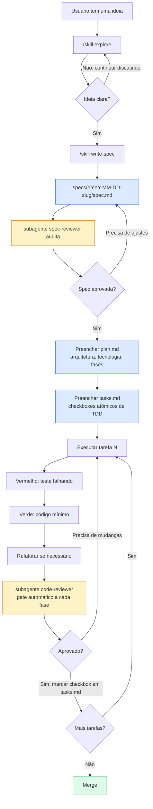

# A camada guiada por spec

> Movido para fora do `README.md` para manter a porta de entrada curta. Linkado a partir de lá.

## Camada guiada por spec

### [`specs/`](./specs/)

O padrão de desenvolvimento guiado por spec, popularizado pelo plugin
Superpowers. Cada feature vive na própria pasta:

```
specs/YYYY-MM-DD-feature-slug/
├─ spec.md       # O QUE construir, fonte da verdade
└─ plan.md       # COMO construir, dividido em tarefas de TDD de 2-5min
```

O fluxo:



Este diagrama mostra o fluxo trabalhado tarefa por tarefa, manualmente
(o `code-reviewer` faz o gate de cada fase). Guiado pelo `/orchestrate` em
vez disso, o mesmo gate roda uma vez por cluster (um grupo de tarefas
relacionadas despachadas juntas), não uma vez por fase.

Quando código e spec divergem, a spec vence. O código é corrigido.

A skill `write-spec` traz os templates de `spec.md` / `plan.md` / `tasks.md`
em [`baseline/skills/write-spec/references/`](./baseline/skills/write-spec/references/)
e os copia para `specs/YYYY-MM-DD-<slug>/` para você.

---
