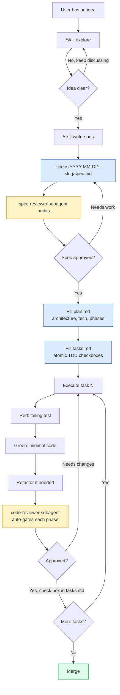

# The spec-driven layer

> Moved out of `README.md` to keep the front door short. Linked from there.

## Spec-driven layer

### [`specs/`](./specs/)

The spec-driven development pattern, popularized by the Superpowers plugin. Each feature lives in its own folder:

```
specs/YYYY-MM-DD-feature-slug/
├─ spec.md       # WHAT to build, source of truth
└─ plan.md       # HOW to build, broken into 2-5min TDD tasks
```

The flow:



This diagram shows the flow worked task by task, by hand — `code-reviewer` gates each phase. Driven by `/orchestrate` instead, the same gate runs once per cluster (a group of related tasks dispatched together), not once per phase.

When code and spec diverge, the spec wins. Code gets fixed.

The `write-spec` skill ships the `spec.md` / `plan.md` / `tasks.md` templates in [`baseline/skills/write-spec/references/`](./baseline/skills/write-spec/references/) and copies them into `specs/YYYY-MM-DD-<slug>/` for you.

---
